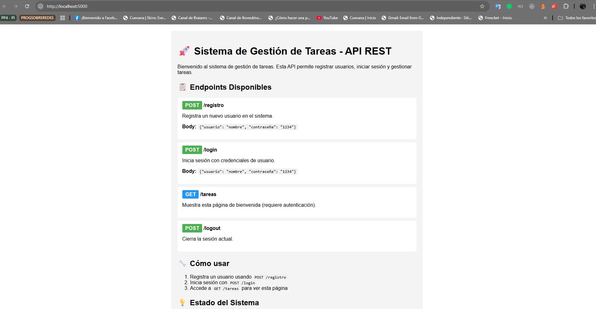
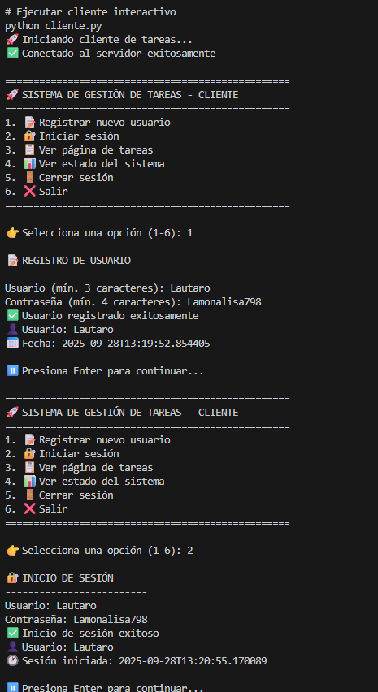

#  Sistema de Gestión de Tareas - PFO 2

Un sistema completo de gestión de tareas con API REST, autenticación segura y base de datos SQLite.

## 📋 Descripción

Este proyecto implementa una API REST con Flask que permite:
- ✅ Registro de usuarios con contraseñas hasheadas
- 🔐 Autenticación segura con sesiones
- 📊 Gestión de datos persistentes con SQLite
- 🌐 Interfaz web responsiva
- 📱 Cliente de consola para pruebas

## 🛠️ Tecnologías Utilizadas

- **Backend**: Flask (Python)
- **Base de datos**: SQLite
- **Seguridad**: bcrypt para hashing de contraseñas
- **Frontend**: HTML5 + CSS3
- **Testing**: Cliente de consola personalizado

## 📁 Estructura del Proyecto

```
sistema-gestion-tareas/
├── servidor.py           # API Flask principal
├── cliente.py           # Cliente de consola para pruebas
├── requirements.txt     # Dependencias del proyecto
├── README.md           # Documentación
├── tareas.db           # Base de datos SQLite (se crea automáticamente)
└── screenshots/        # Capturas de pantalla de pruebas
```

## 🔧 Instalación y Configuración

### 1. Clonar el repositorio

```bash
git clone https://github.com/tu-usuario/sistema-gestion-tareas.git
cd sistema-gestion-tareas
```

### 2. Crear entorno virtual (recomendado)

```bash
python -m venv venv
source venv/bin/activate  # En Windows: venv\Scripts\activate
```

### 3. Instalar dependencias

```bash
pip install -r requirements.txt
```

### 4. Ejecutar el servidor

```bash
python servidor.py
```

El servidor se iniciará en `http://localhost:5000`

## 🚀 Uso del Sistema

### Opción 1: Navegador Web

1. Abre tu navegador en `http://localhost:5000`
2. Verás la página de bienvenida con información de la API

### Opción 2: Cliente de Consola

```bash
python cliente.py
```

El cliente te permitirá:
- Registrar nuevos usuarios
- Iniciar sesión
- Acceder a las tareas
- Ver el estado del sistema

### Opción 3: Herramientas como Postman o curl

#### Registrar usuario:
```bash
curl -X POST http://localhost:5000/registro \
  -H "Content-Type: application/json" \
  -d '{"usuario": "testuser", "contraseña": "1234"}'
```

#### Iniciar sesión:
```bash
curl -X POST http://localhost:5000/login \
  -H "Content-Type: application/json" \
  -d '{"usuario": "testuser", "contraseña": "1234"}' \
  -c cookies.txt
```

#### Acceder a tareas:
```bash
curl -X GET http://localhost:5000/tareas -b cookies.txt
```

## 📡 API Endpoints

### `POST /registro`
**Descripción**: Registra un nuevo usuario en el sistema.

**Request Body**:
```json
{
  "usuario": "nombre_usuario",
  "contraseña": "contraseña_segura"
}
```

**Response (201)**:
```json
{
  "mensaje": "Usuario registrado exitosamente",
  "usuario": "nombre_usuario",
  "fecha_registro": "2024-01-15T10:30:00"
}
```

**Errores posibles**:
- `400`: Campos faltantes o inválidos
- `409`: Usuario ya existe

### `POST /login`
**Descripción**: Autentica a un usuario y crea una sesión.

**Request Body**:
```json
{
  "usuario": "nombre_usuario",
  "contraseña": "contraseña_segura"
}
```

**Response (200)**:
```json
{
  "mensaje": "Inicio de sesión exitoso",
  "usuario": "nombre_usuario",
  "sesion_iniciada": "2024-01-15T10:35:00"
}
```

**Errores posibles**:
- `400`: Credenciales faltantes
- `404`: Usuario no encontrado
- `401`: Contraseña incorrecta

### `GET /tareas`
**Descripción**: Muestra página HTML de bienvenida (requiere autenticación).

**Response (200)**: Página HTML completa con información del usuario autenticado.

**Errores posibles**:
- `401`: Usuario no autenticado

### `POST /logout`
**Descripción**: Cierra la sesión del usuario actual.

**Response (200)**:
```json
{
  "mensaje": "Sesión cerrada exitosamente para nombre_usuario",
  "fecha_logout": "2024-01-15T10:40:00"
}
```

### `GET /status`
**Descripción**: Información del estado del sistema.

**Response (200)**:
```json
{
  "status": "OK",
  "database": "SQLite conectada",
  "usuarios_registrados": 5,
  "tareas_totales": 0,
  "timestamp": "2024-01-15T10:45:00",
  "version": "1.0"
}
```

## 🔐 Seguridad Implementada

### Hashing de Contraseñas
- ✅ Uso de **bcrypt** para hash seguro de contraseñas
- ✅ Salt automático para cada contraseña
- ✅ **NUNCA** se almacenan contraseñas en texto plano
- ✅ Verificación segura con timing attack protection

### Autenticación
- ✅ Sistema de sesiones con Flask
- ✅ Decorador `@require_login` para endpoints protegidos
- ✅ Validación de entrada de datos
- ✅ Manejo seguro de errores sin exponer información sensible

## 💾 Base de Datos SQLite

### Esquema de la Base de Datos

```sql
-- Tabla de usuarios
CREATE TABLE usuarios (
    id INTEGER PRIMARY KEY AUTOINCREMENT,
    usuario TEXT UNIQUE NOT NULL,
    contraseña_hash TEXT NOT NULL,
    fecha_registro TIMESTAMP DEFAULT CURRENT_TIMESTAMP
);

-- Tabla de tareas (preparada para futuras expansiones)
CREATE TABLE tareas (
    id INTEGER PRIMARY KEY AUTOINCREMENT,
    usuario_id INTEGER,
    titulo TEXT NOT NULL,
    descripcion TEXT,
    completada BOOLEAN DEFAULT FALSE,
    fecha_creacion TIMESTAMP DEFAULT CURRENT_TIMESTAMP,
    FOREIGN KEY (usuario_id) REFERENCES usuarios (id)
);
```

### Características de SQLite en este proyecto:
- 📁 **Archivo único**: `tareas.db`
- 🔄 **Creación automática**: Se inicializa al arrancar el servidor
- 🔗 **Relaciones**: Foreign keys entre usuarios y tareas
- 📅 **Timestamps**: Registro automático de fechas
- 🔒 **Integridad**: Constraints para evitar duplicados

## 📸 Capturas de Pantalla

### 1. Página de Inicio

### 2. Cliente de Consola - Menú Principal


```
==================================================
🚀 SISTEMA DE GESTIÓN DE TAREAS - CLIENTE
==================================================
1. 📝 Registrar nuevo usuario
2. 🔐 Iniciar sesión
3. 📋 Ver página de tareas
4. 📊 Ver estado del sistema
5. 🚪 Cerrar sesión
6. ❌ Salir
==================================================
```

### 3. Registro Exitoso
```
📝 REGISTRO DE USUARIO
------------------------------
Usuario (mín. 3 caracteres): testuser
Contraseña (mín. 4 caracteres): 1234
✅ Usuario registrado exitosamente
👤 Usuario: testuser
📅 Fecha: 2024-01-15T10:30:00.123456
```

### 4. Página de Tareas Autenticada
![Página de bienvenida personalizada para el usuario autenticado]

## 🧪 Casos de Prueba

### Test 1: Registro de Usuario
```bash
# Caso exitoso
curl -X POST http://localhost:5000/registro \
  -H "Content-Type: application/json" \
  -d '{"usuario": "usuario1", "contraseña": "pass123"}'

# Resultado esperado: 201 Created
```

### Test 2: Usuario Duplicado
```bash
# Intentar registrar el mismo usuario
curl -X POST http://localhost:5000/registro \
  -H "Content-Type: application/json" \
  -d '{"usuario": "usuario1", "contraseña": "pass456"}'

# Resultado esperado: 409 Conflict
```

### Test 3: Login Exitoso
```bash
curl -X POST http://localhost:5000/login \
  -H "Content-Type: application/json" \
  -d '{"usuario": "usuario1", "contraseña": "pass123"}' \
  -c cookies.txt

# Resultado esperado: 200 OK con mensaje de éxito
```

### Test 4: Acceso sin Autenticación
```bash
curl -X GET http://localhost:5000/tareas

# Resultado esperado: 401 Unauthorized
```

### Test 5: Acceso con Autenticación
```bash
curl -X GET http://localhost:5000/tareas -b cookies.txt

# Resultado esperado: 200 OK con página HTML
```

## 🚨 Troubleshooting

### Error: "No module named 'bcrypt'"
```bash
pip install bcrypt
```

### Error: "Address already in use"
```bash
# Buscar proceso usando el puerto 5000
lsof -i :5000
# Matar el proceso
kill -9 <PID>
```

### Error: "Database is locked"
```bash
# Cerrar todas las conexiones y reiniciar el servidor
rm tareas.db
python servidor.py
```

### El cliente no puede conectarse
1. Verificar que el servidor esté ejecutándose: `http://localhost:5000/status`
2. Revisar firewall y antivirus
3. Probar con `127.0.0.1:5000` en lugar de `localhost:5000`

## 🔄 Desarrollo y Expansiones Futuras

### Funcionalidades Planeadas
- [ ] CRUD completo de tareas
- [ ] Filtros y búsqueda de tareas
- [ ] Categorías y etiquetas
- [ ] API para dispositivos móviles
- [ ] Dashboard con estadísticas
- [ ] Exportación de datos

### Mejoras de Seguridad
- [ ] Rate limiting
- [ ] JWT tokens en lugar de sesiones
- [ ] Validación más estricta de entrada
- [ ] Logging de seguridad
- [ ] HTTPS obligatorio

## 📚 Respuestas Conceptuales

### ¿Por qué hashear contraseñas?

**Seguridad Fundamental**: Hashear contraseñas es una práctica esencial de seguridad porque:

1. **Protección contra brechas de datos**: Si la base de datos es comprometida, las contraseñas reales no están expuestas.

2. **Irreversibilidad**: Las funciones hash son unidireccionales - no se puede obtener la contraseña original desde el hash.

3. **Salt único**: bcrypt genera un salt diferente para cada contraseña, evitando ataques de rainbow table.

4. **Resistencia a ataques**: bcrypt está diseñado para ser computacionalmente costoso, ralentizando ataques de fuerza bruta.

5. **Estándar de la industria**: Es una práctica universalmente aceptada y requerida por regulaciones de seguridad.

**Ejemplo en el código**:
```python
# ❌ NUNCA hacer esto
contraseña = "123456"  # Texto plano

# ✅ Siempre hacer esto
contraseña_hash = bcrypt.hashpw(contraseña.encode('utf-8'), bcrypt.gensalt())
```

### Ventajas de usar SQLite en este proyecto

**1. Simplicidad de Configuración**
- No requiere servidor de base de datos separado
- Configuración cero - funciona inmediatamente
- Ideal para desarrollo y prototipado rápido

**2. Portabilidad**
- Base de datos en un solo archivo
- Fácil de respaldar, transferir y versionar
- Compatible con múltiples sistemas operativos

**3. Rendimiento**
- Muy rápido para aplicaciones pequeñas y medianas
- Optimizado para operaciones de lectura
- Footprint mínimo de memoria

**4. Confiabilidad**
- Transacciones ACID completas
- Resistente a fallos del sistema
- Ampliamente probado y estable

**5. Estándares**
- SQL estándar compatible
- Amplio soporte de herramientas
- Fácil migración a otras bases de datos

**6. Ideal para este Proyecto**
- Perfecto para sistemas pequeños a medianos
- No requiere administración de base de datos
- Suficiente para las necesidades actuales del proyecto

## 🤝 Contribución

1. Fork el proyecto
2. Crea una rama para tu feature (`git checkout -b feature/AmazingFeature`)
3. Commit tus cambios (`git commit -m 'Add some AmazingFeature'`)
4. Push a la rama (`git push origin feature/AmazingFeature`)
5. Abre un Pull Request


## 👨‍💻 Autor

**[Nicolás Lautaro Lanselota]**
- GitHub: [@NicolasLLans](https://github.com/NicolasLLans)

## 🙏 Agradecimientos

- Flask framework por la simplicidad y potencia
- bcrypt por la seguridad en hashing
- SQLite por la confiabilidad y simplicidad
- Comunidad de Python por las excelentes herramientas
# Sistema-de-Gesti-n-de-Tareas---PFO-2
